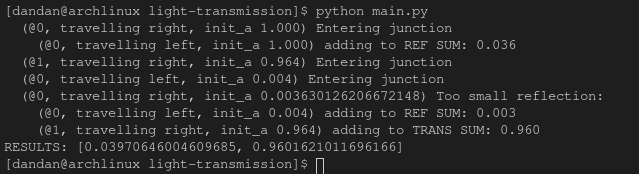
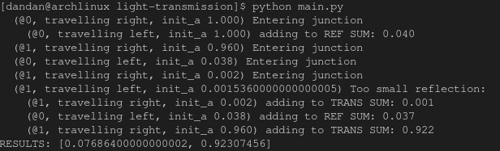

# Light Transmission Simulation
A simulation for a pulse of light travelling through a medium consisting of varying refractive indices. Light enters from the "left" and travels "right". 

Reflections will of course change the direction. Multiple reflections can occur especially in more complex systems. This simple simulation outputs how much light is ultimately reflected and transmitted.

# Examples

A system of 3 media with refractive index 1 (air), 1.47 (vegetable oil), and 1.3 (water) respectively

A system of 3 media with refractive index 1 (air), 1.5 (glass), and 1 (air) respectively.

